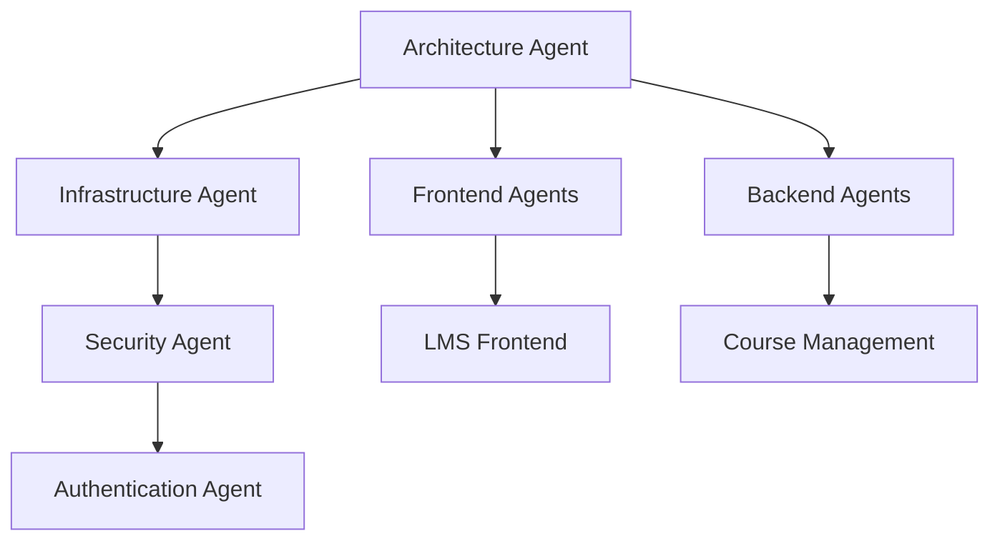

# AGENTS.md
## AI Agents Guide for EduPro Academy Course Platform Development

---

## 🎯 **Project Overview**

**Project Name**: EduPro Academy - Advanced Course Platform  
**Description**: Comprehensive online course platform with Logic Training, Flow Design, and Project Management features  
**Architecture**: Microservices + Event-Driven + Micro-Frontend  
**Timeline**: 10 months  
**Team Size**: 23 developers  
**Budget**: ฿7-8M  

---

## 🤖 **AI Agents Structure**

### **🏗️ Architecture Agent**
```yaml
Agent: System Architect
Role: Design and maintain overall system architecture
Responsibilities:
  - Microservices design and communication patterns
  - Database architecture and data flow
  - API Gateway configuration
  - Event-driven architecture implementation
  - Performance and scalability planning
Tools:
  - Architecture Decision Records (ADR)
  - System design diagrams
  - Performance benchmarking
  - Security architecture review
```

### **🎨 Frontend Agents**

#### **Agent: Landing & Marketing**
```yaml
Agent: Marketing Frontend Specialist
Role: Create compelling landing pages and marketing interfaces
Responsibilities:
  - SEO-optimized landing pages
  - Marketing funnel interfaces
  - A/B testing implementations
  - Conversion optimization
  - Performance marketing integrations
Tech Stack:
  - Next.js 14+ with App Router
  - Tailwind CSS + Framer Motion
  - TypeScript
  - Vercel deployment
Key Features:
  - Hero sections with animations
  - Course preview components
  - Pricing tables
  - Testimonial carousels
  - Contact forms
```

#### **Agent: Learning Management System**
```yaml
Agent: LMS Frontend Specialist
Role: Build comprehensive learning interface
Responsibilities:
  - Course catalog and filtering
  - Video player with custom controls
  - Progress tracking visualization
  - Assessment and quiz interfaces
  - Certificate display system
Tech Stack:
  - React 18 + TypeScript
  - Video.js + HLS.js for streaming
  - React Query for data management
  - Zustand for state management
Key Components:
  - CoursePlayer with chapters
  - ProgressTracker with visual indicators
  - QuizInterface with multiple question types
  - NoteSystem with timestamps
  - DownloadManager for offline content
```

#### **Agent: Interactive Tools**
```yaml
Agent: Interactive Learning Specialist
Role: Create engaging interactive learning experiences
Responsibilities:
  - Logic puzzle interfaces
  - Flow design canvas (drag & drop)
  - Project management boards
  - Real-time collaboration features
  - Gamification elements
Tech Stack:
  - React + Canvas/WebGL
  - Three.js for 3D visualizations
  - Socket.io for real-time features
  - React Flow for diagram building
Advanced Features:
  - Visual logic builder
  - Flow simulation engine
  - Collaborative whiteboards
  - Interactive code playground
  - Achievement animations
```

#### **Agent: Mobile Experience**
```yaml
Agent: Mobile App Specialist
Role: Create native-quality mobile experience
Responsibilities:
  - Course streaming with offline support
  - Touch-optimized interfaces
  - Push notification system
  - Mobile-specific features
  - Performance optimization
Tech Stack:
  - React Native + Expo
  - TypeScript
  - React Navigation 6
  - AsyncStorage for offline data
Mobile Features:
  - Offline video downloading
  - Background audio playback
  - Biometric authentication
  - Camera integration for assignments
  - Location-based features
```

### **🔧 Backend Agents**

#### **Agent: Identity & Access Management**
```yaml
Agent: Authentication Specialist
Role: Secure user management and access control
Responsibilities:
  - Multi-factor authentication
  - OAuth integrations
  - Session management
  - Role-based access control
  - Security monitoring
Tech Stack:
  - Node.js + Express + TypeScript
  - PostgreSQL + Prisma ORM
  - Redis for sessions
  - JWT + OAuth 2.0
Security Features:
  - Password encryption (bcrypt)
  - Rate limiting
  - IP whitelisting
  - Audit logging
  - GDPR compliance
```

#### **Agent: Course Management**
```yaml
Agent: Learning Content Specialist
Role: Manage all learning-related data and operations
Responsibilities:
  - Course CRUD operations
  - Content delivery optimization
  - Progress tracking algorithms
  - Assessment logic
  - Certificate generation
Tech Stack:
  - Node.js + Fastify
  - PostgreSQL for structured data
  - MongoDB for content metadata
  - Redis for caching
  - AWS S3 for media storage
Key APIs:
  - /api/courses - Course management
  - /api/content - Content delivery
  - /api/progress - Learning progress
  - /api/assessments - Quiz and tests
  - /api/certificates - Certification system
```

#### **Agent: AI & Machine Learning**
```yaml
Agent: AI/ML Specialist
Role: Implement intelligent features and recommendations
Responsibilities:
  - Logic puzzle generation
  - Personalized recommendations
  - Learning path optimization
  - Skill assessment algorithms
  - Predictive analytics
Tech Stack:
  - Python + FastAPI
  - TensorFlow/PyTorch
  - Pandas + NumPy
  - Redis for ML caching
  - PostgreSQL for training data
AI Features:
  - Content recommendation engine
  - Adaptive difficulty adjustment
  - Learning style detection
  - Performance prediction
  - Automated content tagging
```

#### **Agent: Payment & Billing**
```yaml
Agent: Financial Operations Specialist
Role: Handle all financial transactions and billing
Responsibilities:
  - Payment processing
  - Subscription management
  - Invoice generation
  - Revenue tracking
  - Refund processing
Tech Stack:
  - Node.js + Express
  - PostgreSQL + Prisma
  - Stripe + PayPal APIs
  - Redis for caching
Payment Features:
  - Multiple payment gateways
  - Recurring billing
  - Proration handling
  - Tax calculations
  - Financial reporting
```

#### **Agent: Communication Services**
```yaml
Agent: Communication Specialist
Role: Enable real-time communication and notifications
Responsibilities:
  - Real-time messaging
  - Video conferencing integration
  - Email services
  - Push notifications
  - Forum management
Tech Stack:
  - Node.js + Socket.io
  - WebRTC for video calls
  - SendGrid for emails
  - Redis Pub/Sub
  - MongoDB for messages
Communication Features:
  - Live chat system
  - Video call rooms
  - Email campaigns
  - In-app notifications
  - Community forums
```

### **🛠️ DevOps & Infrastructure Agents**

#### **Agent: Cloud Infrastructure**
```yaml
Agent: Infrastructure Specialist
Role: Manage cloud resources and deployments
Responsibilities:
  - Kubernetes cluster management
  - CI/CD pipeline setup
  - Auto-scaling configuration
  - Disaster recovery planning
  - Cost optimization
Tech Stack:
  - Kubernetes + Helm
  - AWS/GCP + Terraform
  - GitHub Actions
  - Prometheus + Grafana
  - ArgoCD for GitOps
Infrastructure Components:
  - EKS/GKE clusters
  - Load balancers
  - CDN configuration
  - Database replicas
  - Backup systems
```

#### **Agent: Monitoring & Security**
```yaml
Agent: Security & Monitoring Specialist
Role: Ensure system security and performance
Responsibilities:
  - Security audits and penetration testing
  - Performance monitoring
  - Log aggregation and analysis
  - Compliance management
  - Incident response
Tech Stack:
  - ELK Stack (Elasticsearch, Logstash, Kibana)
  - Prometheus + Grafana
  - Vault for secrets management
  - OWASP security tools
Security Features:
  - Vulnerability scanning
  - WAF configuration
  - SSL/TLS management
  - Data encryption
  - Access logging
```

---

## 📋 **Development Workflow**

### **🔄 Agent Collaboration Process**

#### **Phase 1: Setup & Foundation (Months 1-4)**


#### **Daily Agent Workflow**
```yaml
Morning Sync:
  - Architecture Agent reviews overall progress
  - Each agent reports blockers and dependencies
  - Infrastructure Agent monitors system health
  - Security Agent reviews vulnerability reports

Development Sprint:
  - Frontend agents work on UI components
  - Backend agents develop APIs
  - AI Agent trains and optimizes models
  - Mobile Agent ensures cross-platform consistency

Evening Review:
  - Code reviews and testing
  - Integration testing
  - Performance monitoring
  - Security scans
```

### **🧪 Testing Strategy per Agent**
```yaml
Frontend Agents:
  - Unit tests (Jest + React Testing Library)
  - E2E tests (Cypress)
  - Visual regression tests (Chromatic)
  - Performance tests (Lighthouse)
  - Accessibility tests (axe-core)

Backend Agents:
  - Unit tests (Jest/PyTest)
  - Integration tests (Supertest)
  - API contract tests (Pact)
  - Load tests (k6)
  - Security tests (OWASP ZAP)

Infrastructure Agents:
  - Infrastructure tests (Terratest)
  - Chaos engineering (Chaos Monkey)
  - Disaster recovery tests
  - Performance benchmarks
  - Security audits
```

---

## 🚀 **Agent Deployment Strategy**

### **🐳 Containerization per Agent**
```dockerfile
# Example: Course Management Agent Dockerfile
FROM node:18-alpine
WORKDIR /app
COPY package*.json ./
RUN npm ci --only=production
COPY . .
EXPOSE 3000
USER node
CMD ["npm", "start"]
```

### **☸️ Kubernetes Deployment**
```yaml
# Example: Course Service Deployment
apiVersion: apps/v1
kind: Deployment
metadata:
  name: course-service
  labels:
    app: course-service
    agent: course-management
spec:
  replicas: 3
  selector:
    matchLabels:
      app: course-service
  template:
    metadata:
      labels:
        app: course-service
        agent: course-management
    spec:
      containers:
      - name: course-service
        image: edupro/course-service:latest
        ports:
        - containerPort: 3000
        env:
        - name: DATABASE_URL
          valueFrom:
            secretKeyRef:
              name: db-secret
              key: url
```

---

## 📊 **Agent Performance Metrics**

### **🎯 KPIs per Agent Type**
```yaml
Frontend Agents:
  - Page Load Time: < 2 seconds
  - Lighthouse Score: > 90
  - Core Web Vitals: All green
  - Error Rate: < 0.1%
  - User Engagement: Time on site > 10min

Backend Agents:
  - API Response Time: < 200ms
  - Uptime: > 99.9%
  - Throughput: 1000+ requests/second
  - Error Rate: < 0.01%
  - Database Query Time: < 50ms

Infrastructure Agents:
  - Deployment Time: < 10 minutes
  - Recovery Time: < 5 minutes
  - Cost Efficiency: Within budget
  - Security Score: > 95%
  - Availability: > 99.95%
```

---

## 🔧 **Agent Development Environment**

### **💻 Local Development Setup**
```bash
# Project initialization
git clone https://github.com/edupro/platform
cd platform

# Backend services
cd backend
docker-compose up -d  # Start databases
npm install
npm run dev

# Frontend applications
cd ../frontend
npm install
npm run dev

# Mobile app
cd ../mobile
npm install
npx expo start
```

### **🛠️ Agent-specific Tools**
```yaml
Frontend Agents:
  - Storybook for component development
  - React DevTools
  - Chrome DevTools
  - Figma for design handoff
  - ESLint + Prettier for code quality

Backend Agents:
  - Postman/Insomnia for API testing
  - pgAdmin for database management
  - Redis Insight
  - Docker Desktop
  - Swagger for API documentation

AI/ML Agent:
  - Jupyter Notebooks
  - TensorBoard
  - MLflow for experiment tracking
  - Docker for model deployment
  - GPU instances for training

DevOps Agents:
  - kubectl for Kubernetes
  - Helm for package management
  - Terraform for infrastructure
  - Grafana for monitoring
  - Vault for secrets
```

---

## 📚 **Agent Knowledge Base**

### **📖 Documentation Standards**
```yaml
Each Agent Must Maintain:
  - README.md with setup instructions
  - API documentation (OpenAPI/Swagger)
  - Architecture Decision Records (ADR)
  - Testing documentation
  - Deployment guides
  - Troubleshooting guides
  - Performance benchmarks
```

### **🎓 Training Resources per Agent**
```yaml
Frontend Agents:
  - React 18 best practices
  - TypeScript advanced patterns
  - Performance optimization
  - Accessibility guidelines
  - Modern CSS techniques

Backend Agents:
  - Microservices patterns
  - Database optimization
  - API design principles
  - Security best practices
  - Event-driven architecture

AI/ML Agent:
  - Machine learning algorithms
  - Deep learning frameworks
  - MLOps practices
  - Data engineering
  - Model deployment strategies

DevOps Agents:
  - Kubernetes administration
  - Cloud architecture
  - CI/CD best practices
  - Monitoring and observability
  - Security and compliance
```

---

## 🎯 **Success Criteria**

### **🏆 Agent Success Metrics**
```yaml
Technical Excellence:
  - Code quality score > 90%
  - Test coverage > 80%
  - Performance benchmarks met
  - Security vulnerabilities < 5
  - Documentation completeness > 95%

Business Impact:
  - User satisfaction > 4.5/5
  - System availability > 99.9%
  - Feature delivery on time
  - Budget adherence
  - Performance targets achieved

Team Collaboration:
  - Knowledge sharing sessions
  - Cross-agent collaboration
  - Mentoring junior developers
  - Contributing to open source
  - Continuous learning
```

---

## 🚀 **Getting Started**

### **1. Environment Setup**
```bash
# Clone the repository
git clone https://github.com/edupro/platform
cd platform

# Install dependencies
npm run setup:all

# Start development environment
npm run dev:all
```

### **2. Agent Assignment**
1. Choose your agent role based on expertise
2. Read the agent-specific documentation
3. Set up your development environment
4. Join the agent team Slack channel
5. Attend the daily standup
6. Start with assigned first sprint tasks

### **3. First Day Checklist**
- [ ] Environment setup completed
- [ ] Access to all required tools
- [ ] Agent-specific documentation read
- [ ] Team introductions done
- [ ] First sprint tasks assigned
- [ ] Code review process understood
- [ ] Testing strategy reviewed
- [ ] Deployment process learned

---

## 📞 **Support & Communication**

### **💬 Communication Channels**
- **Slack**: #edupro-general, #agent-[name]
- **Email**: team@edupro.academy
- **Video Calls**: Daily standups, weekly reviews
- **Documentation**: Confluence/Notion workspace
- **Code Reviews**: GitHub PR process

### **🆘 Escalation Process**
1. **Agent Level**: Try to solve within the agent team
2. **Team Lead**: Escalate to technical lead
3. **Architecture**: Consult system architect
4. **Project Manager**: Business/timeline issues
5. **Executive**: Critical system-wide issues

---

**📝 Note**: This AGENTS.md file should be updated regularly as the project evolves and new requirements emerge. Each agent is responsible for maintaining their section and contributing to the overall project success.

**🎯 Goal**: Build the best online course platform in Thailand with cutting-edge technology and exceptional user experience.

---

*Last Updated: 2024 | Version: 1.0 | Next Review: Monthly*